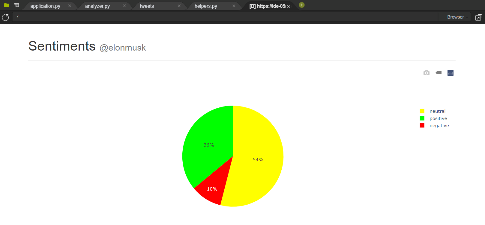
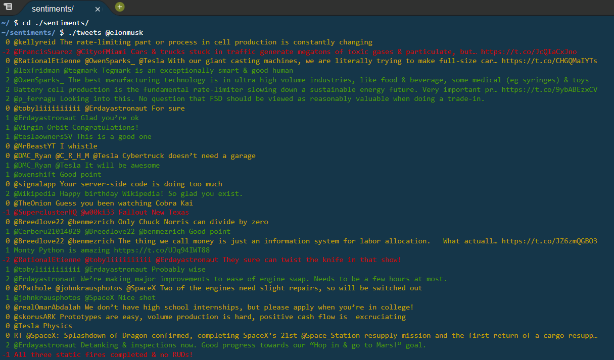

# Sentiment Analysis
Created an 'opinion mining' program that categories the opinion of a user on Twitter by analyzing the diction of their tweets.
  

This project implements an "opinion miner", a problem set from the HarvardX CS50 course, provides the foundation code for this project. For more information, click [here](https://docs.cs50.net/problems/sentiments/sentiments.html).
## Background 
_Sentiment Analysis_ is a 3 part project that contains the following programs:
 - **smile** categorizes a single vocable as a positive or negative word.
 - **tweets** categorizes the recent tweets of a Twitter user as positive or negative.
 
 - Other files encapsulate the implementation of a website that generates a pie chat for categorizing a user's tweets as positive, neutral, or negative.
  
The positive and negative lists of words, **positive-words.txt** and **negative-words.txt** respectively, that are used as standards for referencing in this project were originally categorized by professors at the University of Illinois, Chicago, USA.  

## Program Files
### smile
Imports the _Analyzer_ class and instantiates the _analyzer_ with the positive and negative words. This file validates the command-line arguments and passes _sys.argv[1]_ into the _analyze_ method, thereby assigning the inputted word a score. The score is then interpreted, and the response is then color coded via the _colored_ function and printed to the screen.
### tweets
Works in similar fashion as **smile**, except it accepts the username of a Twitter account.  This file then fetches upto 100 of the user's most recent tweets via the _get_user_timeline_ function (defined in **helpers.py**) and categorizes each tweet. 
### analyzer.py
Implemented in Python, this file is quintessential to this project. The _Analyzer_ class is defined here, containing two functions. The initializing function loads the two _txt_ files into memory for _analyze_ to access, which simply [tokenizes](http://www.nltk.org/api/nltk.tokenize.html) a user's tweet and analyzes its diction via iteration and modifies the _score_ variable accordingly. 
### helpers.py
Defines two functions (_chart_ and _get_user_timeline_), the first of which generates the HTML needed for constructing the pie chart whereas the second returns a list of tweets as Strings. The latter function uses a portmanteau library for Python known as [Twython](https://twython.readthedocs.io/)  in order to retrieve a user's tweets via the [Twitter API](https://dev.twitter.com/overview/api).
### application.py
Contains the endpoint routes for the [Flask](https://flask.palletsprojects.com/en/1.1.x/) based web apps: "_/_" and "_search_", which display the **index.html** form and the resulting pie chart for a user's tweets respectively. 
### templates/
Contains 3 HTML markups: **index.html** configures the form submission; **search.html** render's a username and the corresponding pie char; **layout.html** (the foundation file for the first two HTML files) uses Bootstrap to render the default UI.
